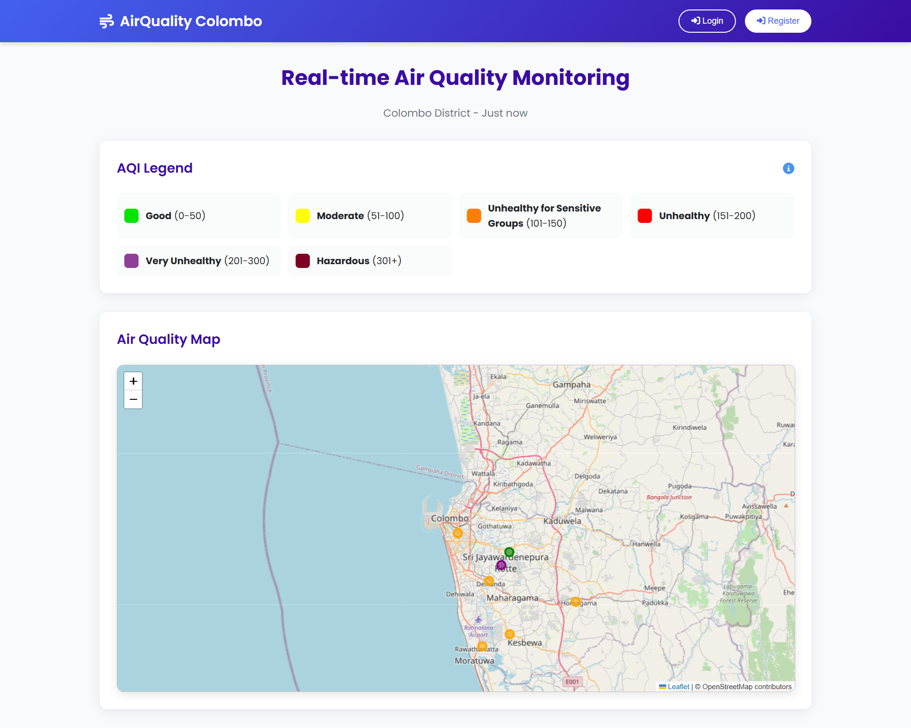
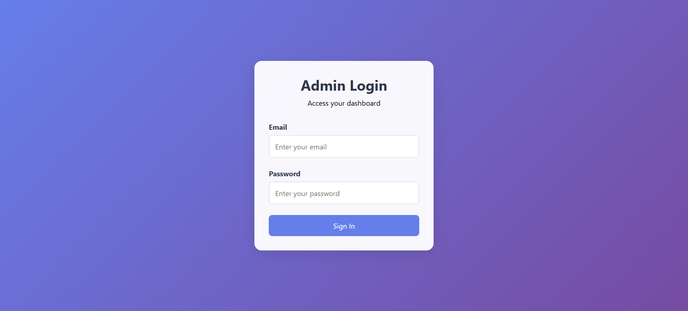
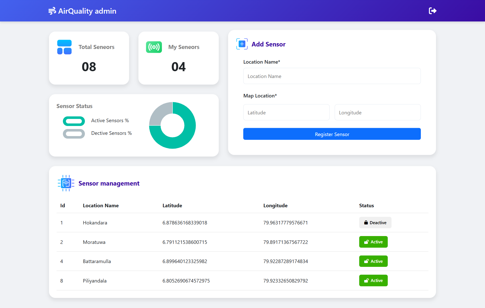
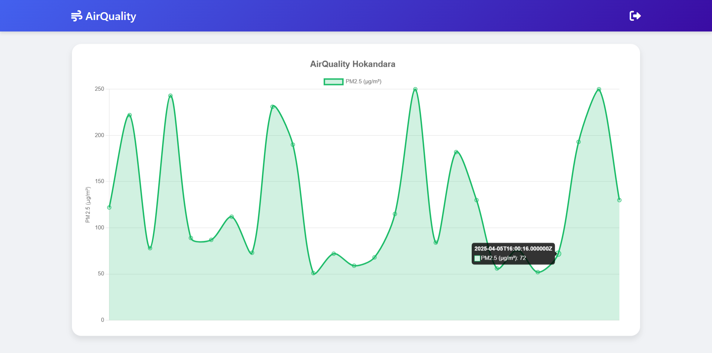
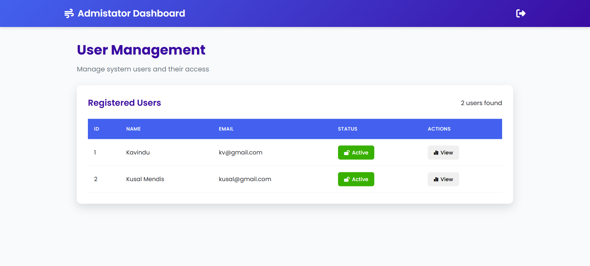
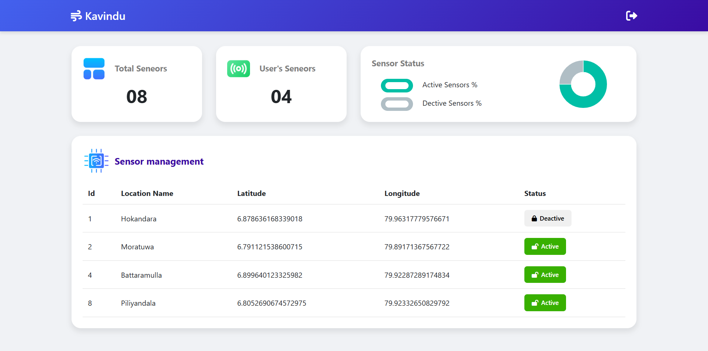
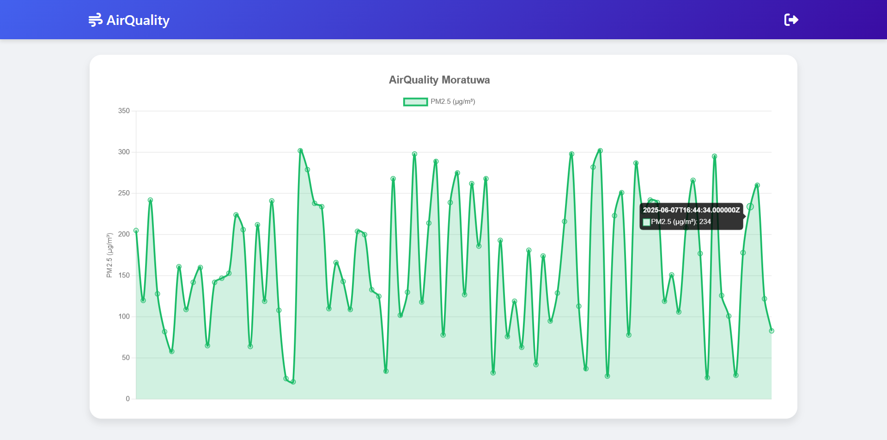

# Air

**Air** is a full-stack Laravel web application developed to monitor and display air quality in Colombo. This project demonstrates proficiency in Laravel for both backend and frontend development, utilizing Blade templating and Chart.js for dynamic data visualization.

## Technologies Used

- **Backend**: Laravel (PHP)
- **Frontend**: Blade (.blade.php), Bootstrap, JavaScript
- **Charts & Maps**: Chart.js, Leaflet.js
- **Database**: MySQL

## Overview

Air provides real-time insights into air quality in specific locations using sensor data. The system includes three user roles:

- **Guest**: Can view the home page with air quality data.
- **Admin**: Can manage their own sensors and view sensor data.
- **Administrator**: Has full access to manage all users and sensors.

Below is a detailed breakdown of each page and user functionality:

---

### Home Page

The home page displays the current air quality index (AQI) over a map centered around Colombo. Features include:

- Air quality sensors visualized as markers on the map.
- AQI color legend for interpretation.
- Guest-friendly interface with public access.

  

 

---

### Login Page

Admins and Administrators can log into the system using their credentials. Guests do not need to log in.

  

 

---

### Admin Dashboard

Admins are assigned sensors and have access to a dashboard with the following features:

- **Add Sensor**: Provide sensor name, latitude, and longitude.
- **Manage Sensors**: View all owned sensors, activate or deactivate them.
- **Analytics**:
  - Total sensors in the system
  - Admin’s owned sensor count
  - Donut chart showing active vs. inactive sensors
- **Sensor History**: View air quality readings over time for each sensor using a line chart.

  

 

 

---

### Administrator Dashboard

Administrators have full control over the platform and can:

- **Manage Admins**: Create, edit, or delete admin users.
- **View & Manage Sensors**: View all sensors added by admins, including their statuses.
- **Sensor Readings**: View real-time and historical data of any sensor in the system.

  

 

 

 

---

## Additional Information

This project was built to demonstrate my full-stack software engineering skills using Laravel. Key highlights:

- Role-based access control (Guest, Admin, Administrator)
- Reusable Blade components and clean routing
- Charts and geolocation with Chart.js and Leaflet.js
- Scalable sensor and user management functionality

## Disclaimer

**This project is part of my professional portfolio. You’re welcome to reference it, but please credit me if you reuse or adapt any part of it.**

## License

This project is licensed under the [MIT License](LICENSE.md).
